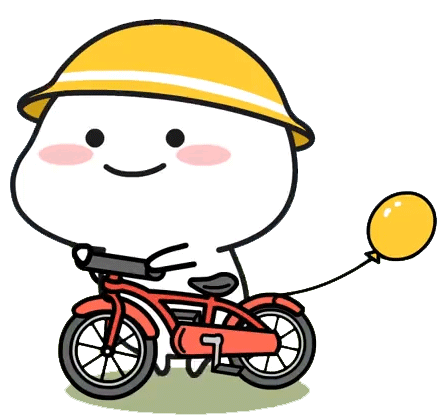
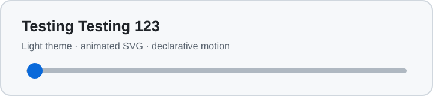
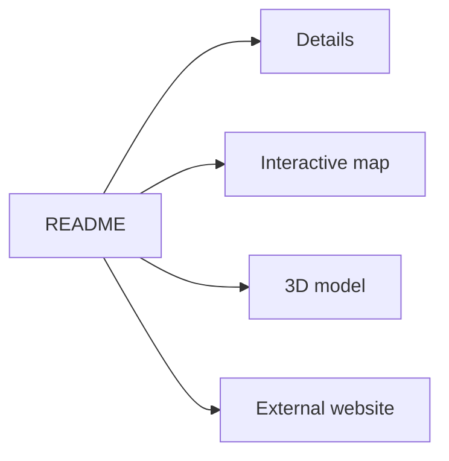

<h1 align="center">Hi, I'm Low Nam Lee</h1>
<p align="center">
  <strong>@lownamlee</strong> &middot; Fullstack developer.
</p>
<p align="center">
  
</p>
<p align="center">
  <a href="https://lownamlee.com">Website</a> &middot;
  <a href="https://github.com/lownamlee?tab=repositories">Repositories</a> &middot;
  <a href="https://github.com/0xburger">0xburger GitHub</a> &middot;
  <a href="https://ctftime.org/team/440041/">0xburger CTFtime</a>
</p>

---

## Hi there 👋

I'm **Low Nam Lee** — a full-stack developer who enjoys working across the stack and exploring complex technical problems. I build, experiment, and share what I learn through my work and projects. Feel free to look around

## Featured projects

<div align="center">
  <p>
    <strong>&#128679; Still under construction &#128679;</strong>
  </p>
  
</div>

## 0xBURGER CTF Team

Meet my CTF Team.

- GitHub: [github.com/0xburger](https://github.com/0xburger)
- LinkedIn: [linkedin.com/company/0xburger](https://www.linkedin.com/company/0xburger/)
- CTFtime: [0xburger](https://ctftime.org/team/440041/)

## Find me

- Website: [lownamlee.com](https://lownamlee.com)
- GitHub: [github.com/lownamlee](https://github.com/lownamlee)
- Email: [admin@lownamlee.com](mailto:admin@lownamlee.com)
- Handle: **@lownamlee**

## Testing Testing 123

> This is a hands-on GitHub README compatibility lab. Each test explains what should happen on the rendered profile. Some tests are intentionally unsupported negative controls.

### 1. Theme, animation, and reduced-motion test

Change GitHub between light and dark themes and refresh this page. The banner should change color. The dot should move unless your system requests reduced motion, in which case a static yellow banner should appear.

<picture>
  <source media="(prefers-reduced-motion: reduce)" srcset="./assets/readme-lab-static.svg">
  <source media="(prefers-color-scheme: dark)" srcset="./assets/readme-lab-dark.svg">
  <source media="(prefers-color-scheme: light)" srcset="./assets/readme-lab-light.svg">
  
</picture>

### 2. Hover, linked button, and anchor tests

- Hover over [this tooltip link](#testing-testing-123 "Native title tooltip: hover test passed") without clicking.
- Hover over the banner above to test its image tooltip.
- Click the badge below. It should behave like a button but navigate to the website rather than execute code inside the README.
- Click [this anchor link](#testing-testing-123) to jump back to the beginning of the lab.

[](https://lownamlee.com/?from=github-readme-lab)

### 3. Click-to-reveal accordion test

These disclosures share the same `name`. On a current browser, opening one should close the other.

<details name="readme-lab-accordion" open>
<summary>Accordion panel A — click me</summary>

This panel starts open. It contains **Markdown**, an image, and a nested disclosure.


<details>
<summary>Nested disclosure test</summary>

If you can read this, nested `<details>` works too.

</details>
</details>

<details name="readme-lab-accordion">
<summary>Accordion panel B — opening me should close panel A</summary>

The modern `<details name="...">` grouping behavior is working if panel A closed automatically.

</details>

### 4. Task-list control test

These look like controls, but checkboxes in a README should be disabled and should not save changes:

- [ ] Incomplete README task
- [x] Completed README task

### 5. Animated and dynamically generated image tests

The first image is an externally generated animated SVG. The second is a dynamic badge whose value should change after new commits, although GitHub's image proxy may cache it.

[](https://github.com/DenverCoder1/readme-typing-svg)

[](https://github.com/lownamlee/lownamlee/commits/main/)

### 6. Mermaid rendering and node-click test

The diagram should render. Try clicking the `README` node. GitHub may show link behavior, block a normal click, or only allow opening it in a new tab; this test documents the current behavior.



### 7. Native interactive GeoJSON map test

This should render as a GitHub-provided interactive map. Try panning, zooming, and selecting the Singapore and Kuala Lumpur points.

```geojson
{
  "type": "FeatureCollection",
  "features": [
    {
      "type": "Feature",
      "properties": {
        "name": "Singapore",
        "description": "README map test point"
      },
      "geometry": {
        "type": "Point",
        "coordinates": [103.8198, 1.3521]
      }
    },
    {
      "type": "Feature",
      "properties": {
        "name": "Kuala Lumpur",
        "description": "README map test point"
      },
      "geometry": {
        "type": "Point",
        "coordinates": [101.6869, 3.1390]
      }
    }
  ]
}
```

### 8. Native interactive STL 3D test

This should render as a tetrahedron in GitHub's 3D viewer. Try dragging to rotate it and scrolling to zoom.

```stl
solid readme_test_tetrahedron
  facet normal 0.0 0.0 -1.0
    outer loop
      vertex 0.0 0.0 0.0
      vertex 0.5 0.866 0.0
      vertex 1.0 0.0 0.0
    endloop
  endfacet
  facet normal 0.0 -0.943 0.333
    outer loop
      vertex 0.0 0.0 0.0
      vertex 1.0 0.0 0.0
      vertex 0.5 0.289 0.816
    endloop
  endfacet
  facet normal 0.816 0.471 0.333
    outer loop
      vertex 1.0 0.0 0.0
      vertex 0.5 0.866 0.0
      vertex 0.5 0.289 0.816
    endloop
  endfacet
  facet normal -0.816 0.471 0.333
    outer loop
      vertex 0.5 0.866 0.0
      vertex 0.0 0.0 0.0
      vertex 0.5 0.289 0.816
    endloop
  endfacet
endsolid readme_test_tetrahedron
```

### 9. Bookmarklet test

The link below is an intentional negative test. GitHub should remove its `javascript:` destination, so it should render as plain text or an inert link rather than execute:

[Direct bookmarklet installation attempt](javascript:alert(1))

For a manual test, copy the following text into the URL field of a new browser bookmark, open any ordinary page, and click the bookmark:

```javascript
javascript:(()=>{alert('README bookmarklet test: the manually installed bookmarklet works')})()
```

A real drag-to-install bookmarklet would need to live on the linked website or another normal HTTPS page, not inside this README.

### 10. Sanitization negative controls

Open this section to see what GitHub removes or converts to plain text. No control below is expected to execute inside the rendered README.

<details>
<summary>Show blocked HTML, CSS, JavaScript, form, iframe, and inline SVG tests</summary>

The styled text below should not become red or react to hover:

<style>.readme-lab-hover:hover { color: red; transform: scale(1.2); }</style>
<span class="readme-lab-hover" style="color: red" onmouseover="console.log('This should not run')">Unsupported CSS hover test</span>

The following button and form controls should be removed or reduced to plain text:

<button type="button" onclick="alert('This should not run')">Unsupported executable button</button>

Raw checkbox before [<input type="checkbox" checked>] raw checkbox after.

<form action="https://example.com" method="get">
  <input name="readme-test" value="This input should be removed">
  <select name="choice">
    <option value="one">One</option>
    <option value="two">Two</option>
  </select>
  <button type="submit">Unsupported form submit</button>
</form>

The following script and iframe should be escaped, removed, or displayed only as inert text:

<script>console.log('README scripts must not execute')</script>
<iframe src="https://example.com" title="Unsupported README iframe"></iframe>

The inline SVG should be flattened or removed rather than becoming an interactive SVG document:

<svg xmlns="http://www.w3.org/2000/svg" width="240" height="40" onload="console.log('This should not run')">
  <rect width="240" height="40" fill="tomato"></rect>
  <text x="8" y="26">Unsupported inline SVG</text>
</svg>

This abbreviation's rich HTML tooltip is also expected to be removed: <abbr title="Expanded hover content">HTML</abbr>.

[Blocked data URL test](data:text/html,%3Ch1%3EBlocked%3C%2Fh1%3E)

</details>

### 11. Footnote navigation test

This sentence has a clickable footnote reference.[^readme-lab-footnote]

[^readme-lab-footnote]: If GitHub scrolled you here and provided a return link, footnote navigation works.
